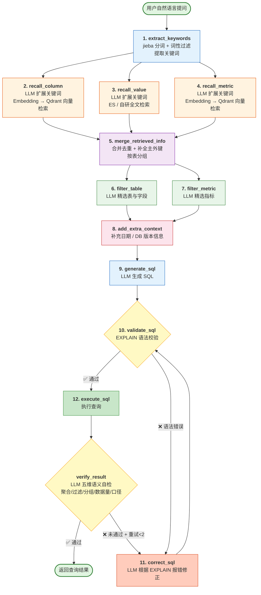
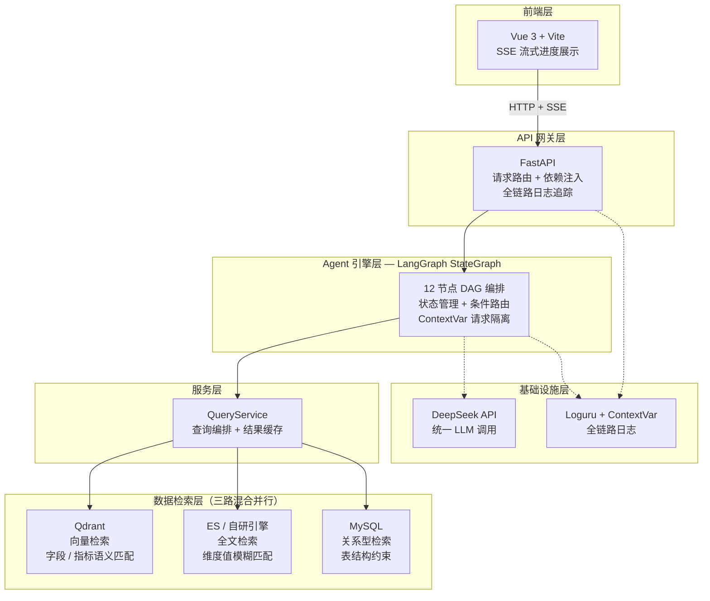

# 智达方舟 — 自然语言转 SQL 智能查询系统

> 让业务人员用大白话直接查数据库，将查数从 3 天缩短到 10 秒。

## 项目概述

面向企业内部数据查询场景构建的 Text-to-SQL 系统。用户用中文自然语言提问，系统自动完成语义理解 → 元数据检索 → SQL 生成 → 双层自愈校验 → 执行返回的全链路自动化。

## 核心亮点

- **12 节点 Agent DAG 工作流**：基于 LangGraph StateGraph 构建，支持并行召回、条件路由与自愈闭环
- **三路混合元数据检索**：Qdrant 向量检索 + ES/自研全文检索 + MySQL 关系型检索，并行执行
- **双层 SQL 自愈闭环**：EXPLAIN 语法校验 + LLM 四维度语义自检，语法修正一次通过率 80%，有效抑制大模型幻觉
- **自研零依赖搜索引擎**：纯 Python 实现（jieba 分词 + 倒排索引），接口兼容 AsyncElasticsearch
- **SSE 流式进度推送**：12 步工作流节点实时推送到前端，全流程可视化
- **全链路日志追踪**：FastAPI 中间件 + Loguru + ContextVar，每个请求自动注入唯一 request_id

## 完整链路图

### 12 节点 Agent DAG 工作流



> **关键路径说明**：蓝底节点为 LLM 推理节点，橙底为并行检索节点，黄底为校验决策节点，红底为修正节点。虚线回路构成**双层 SQL 自愈闭环**——第 1 层通过 EXPLAIN 修正语法错误，第 2 层通过五维语义校验修正逻辑错误。

### 系统分层架构



## 技术栈

| 分类 | 技术 |
|------|------|
| 后端 | Python 3.12, FastAPI, LangGraph, DeepSeek |
| 向量检索 | Qdrant（bge-large-zh-v1.5） |
| 全文检索 | Elasticsearch / 自研 SimpleSearchClient |
| 关系型检索 | SQLAlchemy + asyncmy + MySQL 8.0 |
| 前端 | Vue 3 + Vite（原生 Fetch + SSE） |

## 仓库结构

```
RAG智达方舟/
├── data-agent/           # 后端服务（核心代码）
├── data-agent-fronted/   # 前端（Vue 3）
├── main.py
└── README.md             # 你正在看
```

详细使用文档见 [data-agent/README.md](data-agent/README.md) 与 [data-agent/rag智达方舟.md](data-agent/rag智达方舟.md)。

## 快速启动

```bash
# 后端
cd data-agent && uv sync
uv run python -m app.scripts.create_dw_data
uv run python -m app.scripts.build_meta_knowledge -c conf/meta_config.yaml
uv run python main.py                              # :8000

# 前端
cd data-agent-fronted && npm install && npm run dev   # :5173
```

环境要求：Python 3.12+, MySQL 8.0+, Qdrant, Node.js 18+。

## 作者

李曜均 · 19120595422@163.com